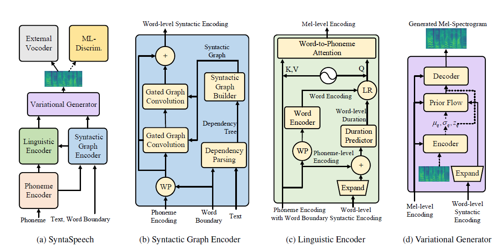

# SyntaSpeech: Syntax-Aware Generative Adversarial Text-to-Speech

[](https://arxiv.org/abs/2204.11792) | [](https://github.com/yerfor/SyntaSpeech) | [](https://huggingface.co/spaces/yerfor/SyntaSpeech) | [中文文档](README-zh.md)

This repository is the official PyTorch implementation of our IJCAI-2022 [paper](https://arxiv.org/abs/2204.11792), in which we propose **SyntaSpeech** for syntax-aware non-autoregressive Text-to-Speech.

<p align="center">
    <br>
    
    <br>
</p>

Our SyntaSpeech is built on the basis of  [PortaSpeech](https://github.com/NATSpeech/NATSpeech) (NeurIPS 2021) with three new features:

1. We propose **Syntactic Graph Builder (Sec. 3.1)** and **Syntactic Graph Encoder (Sec. 3.2)**, which is proved to be an effective unit to extract syntactic features to improve the prosody modeling and duration accuracy of TTS model.
2. We introduce **Multi-Length Adversarial Training (Sec. 3.3)**, which could replace the flow-based post-net in PortaSpeech, speeding up the inference time and improving the audio quality naturalness.
3. We support three datasets: [LJSpeech](https://keithito.com/LJ-Speech-Dataset/) (single-speaker English dataset), [Biaobei](https://www.data-baker.com/open%20source.html) (single-speaker Chinese dataset) , and [LibriTTS](http://www.openslr.org/60) (multi-speaker English dataset).

## Environments

```bash
conda create -n synta python=3.7
condac activate synta
pip install -U pip
pip install Cython numpy==1.19.1
pip install torch==1.9.0 
pip install -r requirements.txt
# install dgl for graph neural network, dgl-cu102 supports rtx2080, dgl-cu113 support rtx3090
pip install dgl-cu102 dglgo -f https://data.dgl.ai/wheels/repo.html 
sudo apt install -y sox libsox-fmt-mp3
bash mfa_usr/install_mfa.sh # install force alignment tools
```

## Run SyntaSpeech!

**Please follow the following steps to run this repo.**

### 1. Preparation

#### Data Preparation

You can directly use our binarized datasets for [LJSpeech](https://drive.google.com/file/d/1WfErAxKqMluQU3vupWS6VB6NdehXwCKM/view?usp=sharing) and [Biaobei](https://drive.google.com/file/d/1-ApEbBrW5kfF0jM18EmW7DCsll-c1ROp/view?usp=sharing). Download them and unzip them into the `data/binary/` folder.

As for LibriTTS, you can download the raw datasets and process them with our `data_gen` modules. Detailed instructions can be found in [dosc/prepare_data](docs/prepare_data.md).

#### Vocoder Preparation

We provide the pre-trained model of vocoders for three datasets. Specifically, Hifi-GAN for [LJSpeech](https://drive.google.com/file/d/1D8ABD4fa7TK6t_ymzzhtxsWHPhg7OXcG/view?usp=sharing) and [Biaobei](https://drive.google.com/file/d/1onZbPA7rjR1ibmyV1Z-7G22j2Nekiic5/view?usp=sharing), ParallelWaveGAN for [LibriTTS](https://drive.google.com/file/d/1AziBns4R6UDtrAWaIBRm5hWg9io38EWh/view?usp=sharing). Download and unzip them into the `checkpoints/` folder.

### 2. Training Example

Then you can train SyntaSpeech in the three datasets.

```bash
cd <the root_dir of your SyntaSpeech folder>
export PYTHONPATH=./
CUDA_VISIBLE_DEVICES=0 python tasks/run.py --config egs/tts/lj/synta.yaml --exp_name lj_synta --reset # training in LJSpeech
CUDA_VISIBLE_DEVICES=0 python tasks/run.py --config egs/tts/biaobei/synta.yaml --exp_name biaobei_synta --reset # training in Biaobei
CUDA_VISIBLE_DEVICES=0 python tasks/run.py --config egs/tts/libritts/synta.yaml --exp_name libritts_synta --reset # training in LibriTTS
```

### 3. Tensorboard

```bash
tensorboard --logdir=checkpoints/lj_synta
tensorboard --logdir=checkpoints/biaobei_synta
tensorboard --logdir=checkpoints/libritts_synta
```

### 4. Inference Example

```bash
CUDA_VISIBLE_DEVICES=0 python tasks/run.py --config egs/tts/lj/synta.yaml --exp_name lj_synta --reset --infer # inference in LJSpeech
CUDA_VISIBLE_DEVICES=0 python tasks/run.py --config egs/tts/biaobei/synta.yaml --exp_name biaobei_synta --reset --infer # inference in Biaobei
CUDA_VISIBLE_DEVICES=0 python tasks/run.py --config egs/tts/libritts/synta.yaml --exp_name libritts_synta --reset ---infer # inference in LibriTTS
```

## Audio Demos

Audio samples in the paper can be found in our [demo page](https://syntaspeech.github.io/).

We also provide [HuggingFace Demo Page](https://huggingface.co/spaces/yerfor/SyntaSpeech) for LJSpeech. Try your interesting sentences there!

## Citation

```
@article{ye2022syntaspeech,
  title={SyntaSpeech: Syntax-Aware Generative Adversarial Text-to-Speech},
  author={Ye, Zhenhui and Zhao, Zhou and Ren, Yi and Wu, Fei},
  journal={arXiv preprint arXiv:2204.11792},
  year={2022}
}
```

## Acknowledgements

**Our codes are based on the following repos:**

* [NATSpeech](https://github.com/NATSpeech/NATSpeech)
* [PyTorch Lightning](https://github.com/PyTorchLightning/pytorch-lightning)
* [ParallelWaveGAN](https://github.com/kan-bayashi/ParallelWaveGAN)
* [HifiGAN](https://github.com/jik876/hifi-gan)
* [espnet](https://github.com/espnet/espnet)
* [Glow-TTS](https://github.com/jaywalnut310/glow-tts)
* [DiffSpeech](https://github.com/MoonInTheRiver/DiffSinger)
